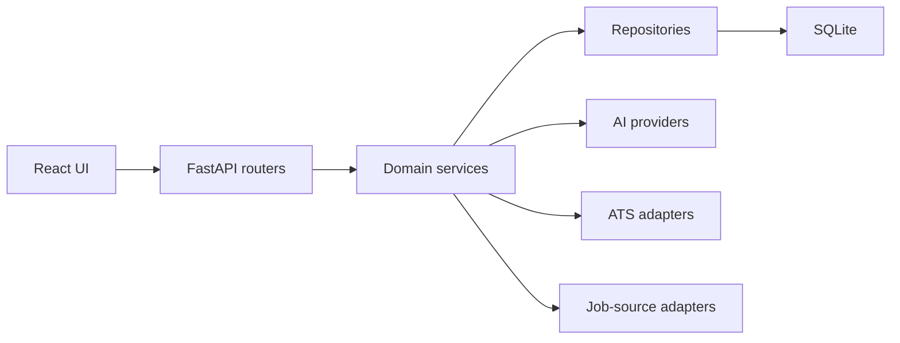

# Developer Guide

## Architecture

The React application calls a FastAPI service. API routers delegate to services,
services contain business rules, and repositories own SQLAlchemy persistence.
Provider interfaces isolate AI, job sources, storage, and ATS automation.

## Local setup

Run `.\scripts\setup.ps1`. Use `.\scripts\test.ps1` for tests and
`.\scripts\lint.ps1` for lint, type checking, and the production frontend build.

## Database changes

Create one Alembic revision for each coherent schema change. Validate the complete
migration chain on an empty database and against a restored backup before release.

## Release policy

The source version, frontend package version, backend package version, changelog, and
Git tag must agree. A release tag is created only after all local and CI checks pass.
Do not tag a commit containing secrets, personal data, databases, or generated resumes.
